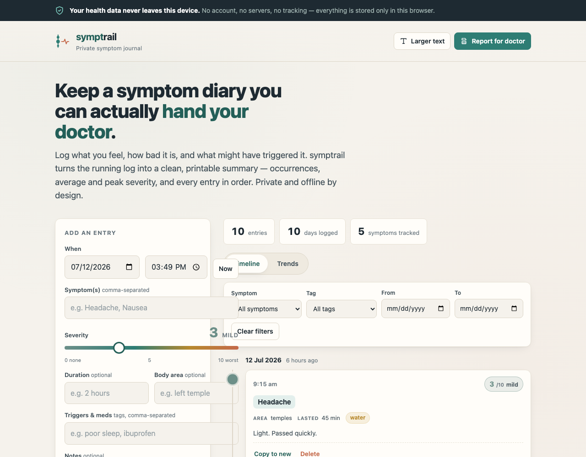

# symptrail

A private, offline symptom journal that turns your day-to-day log into a clean report you can hand your doctor — with your health data never leaving your device.



## Why it exists

Most people arrive at an appointment trying to remember, on the spot, how often something happened, how bad it got, and what seemed to set it off. The honest answer is usually a blur. symptrail is the small, boring habit that fixes that: jot each episode down when it happens — severity, duration, body area, triggers and meds — and when it is time to see a clinician, print a single, ordered summary with occurrences, average and peak severity, and last-seen dates per symptom.

It is deliberately private. Health notes are sensitive, so this tool has no account, no server and no analytics. Everything is stored in your own browser, and the page ships a strict Content-Security-Policy with `connect-src 'none'` — so it physically cannot send your data anywhere, even if it wanted to. Once loaded, it works fully offline.

## What it does

- **Quick add** — date and time default to now; one or more symptoms with remembered recents, a 0–10 severity slider, optional duration and body area, comma-separated tags for triggers and meds, and free-text notes.
- **Timeline** — a chronological view grouped by day, with severity-scaled nodes on a timeline spine.
- **Trends** — severity over time per symptom, drawn as inline SVG (no chart library, no network).
- **Filter** — by symptom, tag and date range.
- **Doctor's report** — a print-optimised report for a chosen date range: a summary table (per symptom: occurrences, average and peak severity, last seen) followed by every entry in order. `Print` → *Save as PDF*.
- **Your data** — JSON export and import for backup or moving between devices, plus a double-confirmed *Delete everything*.
- **Accessible** — large tap targets, WCAG-AA contrast, keyboard operable, visible focus, an optional larger-text mode, `prefers-reduced-motion` support, and colour-blind-safe severity colours.

## Quickstart

```sh
npm install
npm run dev      # local dev server
npm run build    # production build to ./dist/
```

The site is configured for a GitHub Pages base path; every asset is referenced through `import.meta.env.BASE_URL`, so nothing 404s when served from a subpath.

## Privacy

There is no back end. Entries live in your browser's `localStorage` and are never uploaded. The Content-Security-Policy blocks all outbound connections (`connect-src 'none'`), so your health information cannot leave the device. Clearing your browser data, or using a different browser or device, gives you a fresh empty log — which is exactly why the JSON backup export exists.

## Disclaimer

**symptrail is a personal record-keeping tool. It is NOT medical advice and NOT a diagnostic device.** It cannot diagnose, treat, or prevent any condition, and nothing in it is a substitute for professional judgement. Always consult a qualified health professional about your symptoms, and seek urgent care for anything severe or worsening. **The authors accept no liability of any kind** for any decisions made, or outcomes arising, from use of this tool. It is provided "as is", without warranty of any kind — see [LICENSE](./LICENSE).

## Tech

- [Astro](https://astro.build) static build, output to `dist/`.
- 100% client-side vanilla JavaScript, served same-origin to satisfy `script-src 'self'`.
- No runtime dependencies, no analytics, no fonts or assets loaded from the network.

## License

[MIT](./LICENSE) © 2026 Sreenivas Sadhu Prabhakara
